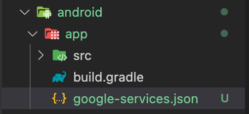

# Flutter Firebase Email & Password Login Example

> 필요한 패키지  
> 설치 방법  
> `pubspec.yaml` 에 copy & paste 후 `flutter pub get` 명령어 실행
> ```yaml
> dependencies:
>   get: ^4.6.1
>   firebase_auth: ^3.3.5
>   cloud_firestore: ^3.1.6
>   firebase_core: ^1.11.0
> ```
> `terminal` 에 아래 명령어 입력
> ```shell
> $ flutter pub add get
> $ flutter pub add firebase_auth
> $ flutter pub add cloud_firestore
> $ flutter pub add firebase_core
> ```
## 1. UI 생성

## 2. Firebase 연결
[Android]
google-service.json 다운로드  


Firebase 초기화
```dart
Future<void> main() async {
  WidgetsFlutterBinding.ensureInitialized(); // Flutter 비동기 실행을 위한 코드
  await Firebase.initializeApp(); // Firebase 초기화
  runApp(const MyApp());
}
```

## 3. Authentication 작업

## 4. 각종 예외 처리
### 4.1. validator 예제 코드
```dart
class MyCustomFormState의 extends State<MyCustomFormState> {
  // Form에 부여할 수 있는 유니크한 GlobalKey를 생성한다.
  final _formKey = GlobalKey<FormState>();

  @override
  Widget build(BuildContext context) {
    // Form 위젯 생성
    // Form 위젯은 컨테이너처럼 동작하면서, 복수의 Form 내의 FormField를 그룹화하고 적합성을 확인함
    return Form(
      // FormField에 부여했던 GlobalKey를 Form에 할당함
      key: _formKey,
      child: Column(
        // Column 내 위젯들을 왼쪽부터 정렬함
        crossAxisAlignment: CrossAxisAlignment.start,
        children: <Widget>[
          // TextFormField 추가
          TextFormField(
            // TextFormField에 validator 추가
            validator: (value) {
              // 입력값이 없으면 메시지 출력
              if (value.isEmpty) {
                return 'Enter some text';
              } else
                return null;
            },
          ),
          Padding(
            padding: const EdgeInsets.symmetric(vertical: 16.0),
            child: RaisedButton(
              onPressed: () {
                // TextFormField의 상태가 적함하는
                if (_formKey.currentState.validate()) {
                  // SnackBar를 통해 메시지 출력
                  Scaffold.of(context)
                      .showSnackBar(SnackBar(content: Text('Processing Data')));
                }
              },
              // Button에 Text 부여
              child: Text('Submit'),
            ),
          )
        ],
      ),
    );
  }
}
```
예제 코드 출처:
[독행소년 티스토리](https://here4you.tistory.com/126)

## 5. 이메일 인증 처리